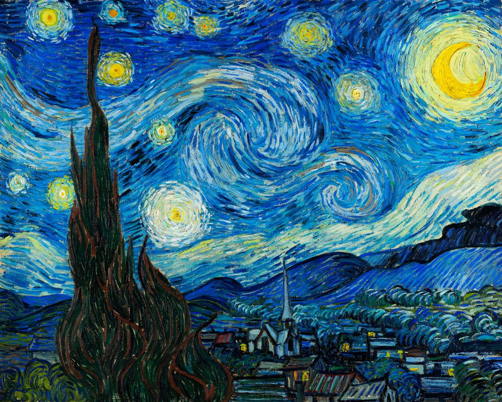
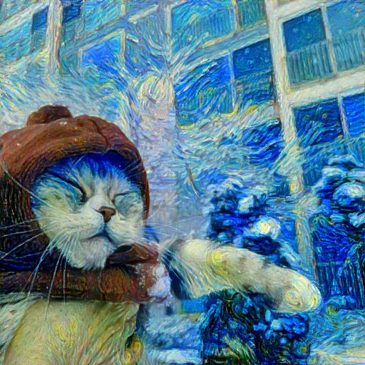
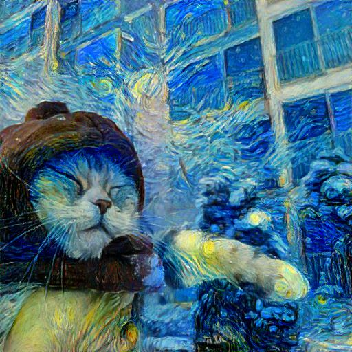

# Image Style Transfer Using Convolutional Neural Networks

This is an unofficial implementation of [Image Style Transfer Using Convolutional Neural Networks](https://www.cv-foundation.org/openaccess/content_cvpr_2016/papers/Gatys_Image_Style_Transfer_CVPR_2016_paper.pdf)

## Environment setup
```sh
pip install -r requirements.txt
```

## Transfer Image Style
```sh
python train.py
```

<table align="center">
  <tr>
    <th style="text-align: center;">Content Image</th>
    <th style="text-align: center;">Style Image</th>
  </tr>
  <tr>
    <td></td>
    <td></td>
  </tr>
</table>

<table align="center">
  <tr>
    <th style="text-align: center;">Optimizer: Adam</th>
    <th style="text-align: center;">Optimizer: LBFGS (paper)</th>
  </tr>
  <tr>
    <td></td>
    <td></td>
  </tr>
</table>
